# Baselines/BaselineVSLAMLAB.py

**Section:** [`# Ensure Installed`](BaselineVSLAMLAB.py#L65)

```mermaid
flowchart LR
    EI([ensure_installed]) --> FS[fetch_source] --> HS1{has_source?}
    HS1 -- no --> ENV1[ensure_pixi_env] --> FETCH["pixi run --frozen -e env fetch-source"] --> HS2{has_source?}
    HS2 -- no --> EXIT1([exit 1])
    HS1 -- yes --> INST[install]
    HS2 -- yes --> INST
    INST --> II1{is_installed?}
    II1 -- no --> ENV2[ensure_pixi_env] --> BUILD["pixi run --frozen -e env install -v<br/>(log: install_&lt;name&gt;.txt)"] --> II2{is_installed?}
    II2 -- no --> EXIT2([exit 1])
    II1 -- yes --> DONE([done])
    II2 -- yes --> DONE

    %% VSLAM-LAB logo squares: cyan #b5f3f9, periwinkle #8195fb, lavender #a59ddf
    classDef entry fill:#8195fb,stroke:#5f74d6,color:#fff
    classDef step fill:#b5f3f9,stroke:#7fcfd8,color:#1b2a4a
    classDef check fill:#a59ddf,stroke:#7e75c4,color:#1b2a4a
    classDef cmd fill:#fff,stroke:#8195fb,color:#1b2a4a
    classDef stop fill:#fff,stroke:#c0392b,color:#c0392b

    class EI,DONE entry
    class FS,INST,ENV1,ENV2 step
    class HS1,HS2,II1,II2 check
    class FETCH,BUILD cmd
    class EXIT1,EXIT2 stop
```


```python
def ensure_installed(self) -> None
```
- orchestrator: `fetch_source()` then `install()`; both early-return when nothing to do, so the steady-state cost is two filesystem stats per run.
- called from: `run_sequence` (every run), `vslamlab_utilities.install_baseline` (`pixi run install-baseline`), which is now just this call.

```python
def ensure_pixi_env(self) -> None
```
- `pixi install -e <env>`: solves/installs the env (refreshing `pixi.lock` if `pixi.toml` changed) so the `--frozen` tasks below can run; output stays on the terminal. Runs once per process (`_pixi_env_ready` flag).

```python
def has_source(self) -> bool
```
- the `fetch-source` pixi task must leave a `.git` at `baseline_path`, or the subclass overrides `has_source`.
- called from: `info_print` (path status).

```python
def fetch_source(self) -> None
```
- streams the `fetch-source` task to the terminal (no log file); exits with an error if `has_source()` is still false afterwards.

```python
def is_installed(self) -> tuple[bool, str]
```
- not abstract anymore: base default returns `has_source()`, right for conda-package baselines (no `install` pixi task; the executable ships in the env). Source-built baselines (`-dev`, allfeature, vggt, pycuvslam) override it with a build-artifact check.
- called from: `info_print`, `vslamlab_utilities.check_experiment_baselines_installed` (pre-flight status list before an experiment).

```python
def install(self) -> None
```
- same shape as `fetch_source`, but keeps its log at `<baseline_path>/install_<name>.txt`; exits with an error (including the `is_installed` message) if still not installed afterwards. The trailing `-v` is forwarded to the task (`./build.sh -v`, `pip -v`), not to pixi.

**Section:** [`# Build Execute Command`](BaselineVSLAMLAB.py#L122)

```mermaid
flowchart LR
    BEC([build_execute_command]) --> CS{command_style<br/>known?}
    CS -- no --> EXIT1([exit 1])
    CS -- yes --> FIXED[fixed arguments<br/>sequence_path, calibration_yaml, rgb_csv,<br/>exp_folder, exp_id / exp_it, settings_yaml]
    FIXED --> RP[resolve_parameters] --> MERGE[defaults ← exp Parameters:]
    MERGE --> UNK{unknown<br/>keys?}
    UNK -- yes --> WARN[warning] --> MODE
    UNK -- no --> MODE{mode in<br/>self.modes?}
    MODE -- no --> EXIT2([exit 1])
    MODE -- yes --> FMT["format tokens (style) + shlex.quote"] --> CMD(["pixi run --frozen -e env execute-mode tokens..."])

    %% VSLAM-LAB logo squares: cyan #b5f3f9, periwinkle #8195fb, lavender #a59ddf
    classDef entry fill:#8195fb,stroke:#5f74d6,color:#fff
    classDef step fill:#b5f3f9,stroke:#7fcfd8,color:#1b2a4a
    classDef check fill:#a59ddf,stroke:#7e75c4,color:#1b2a4a
    classDef cmd fill:#fff,stroke:#8195fb,color:#1b2a4a
    classDef stop fill:#fff,stroke:#c0392b,color:#c0392b

    class BEC,CMD entry
    class FIXED,RP,MERGE,WARN step
    class CS,UNK,MODE check
    class FMT cmd
    class EXIT1,EXIT2 stop
```


```python
_COMMAND_STYLES: dict[str, tuple[str, str]]
self.command_style: str
```
- the entry-point argument style, one row per style: `cpp` formats tokens as `key:value` and names the run index `exp_id`; `python` formats `--key value` and names it `exp_it`. Each concrete baseline sets `self.command_style` in `__init__` next to `modes`/`cam_models`; the `-dev` subclasses inherit it. The two run-index names differ only because the C++ and Python entry points were written that way.

```python
def resolve_parameters(self, exp: Experiment) -> dict
```
- the baseline's parameters for this run: `default_parameters`, each overridden by the same key in the experiment's `Parameters:` block. Insertion order (= defaults order) is the token order in the command.
- warns (verbosity `LOW`, does not exit) about experiment keys that are neither in `default_parameters` nor in `path_constants.EXP_FRAMEWORK_PARAMETERS` (the `rgb_*`/`refraction`/`segmentation`/`depth`/`calibration` keys consumed by `Run/run_functions.py` itself). A warning, not an exit, because one experiment yaml is routinely shared across baselines with different parameter sets.
- override hook for parameters derived from other parameters: allfeature/anyfeature call `super()` then fill the `feature_name_to_fill` placeholder in `feature_yaml` with `feature`.

```python
def build_execute_command(self, exp_it: int, exp: Experiment, dataset: DatasetVSLAMLAB, sequence_name: str) -> str
```
- not abstract: builds `pixi run --frozen -e <baseline_name> execute-<mode> <tokens...>` from the fixed per-run arguments (paths under `<exp.folder>/<dataset_folder>/<sequence>`, all pre-written by `run_sequence`), then `resolve_parameters`. Exits with an error if `command_style` is unknown or `mode` is not in `self.modes` (this is what turns `mode: monoo` into a message instead of a pixi task-not-found later).
- every value goes through `shlex.quote` (POSIX; a no-op for plain values) because `execute()` runs the string with `shell=True`. The result stays a plain string so `Run/ablations.prepare_ablation` can still post-process it.
- override hook for side steps only (colmap downloads its vocabulary tree when `matcher_type: sequential`, then calls `super()`); parameter derivation belongs in `resolve_parameters`.
- called from: `run_sequence` (once per run, after `create_calibration_exp_yaml`/`create_rgb_exp_csv`).